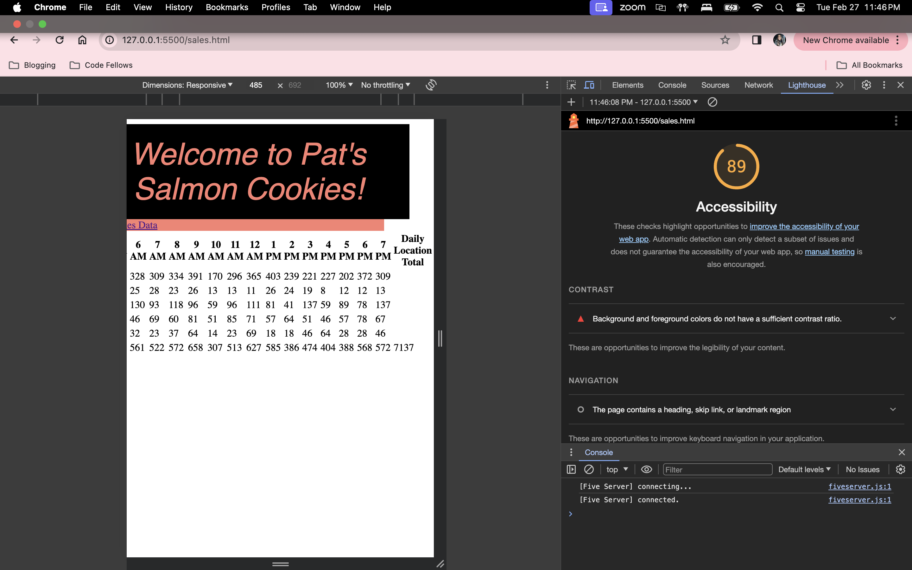
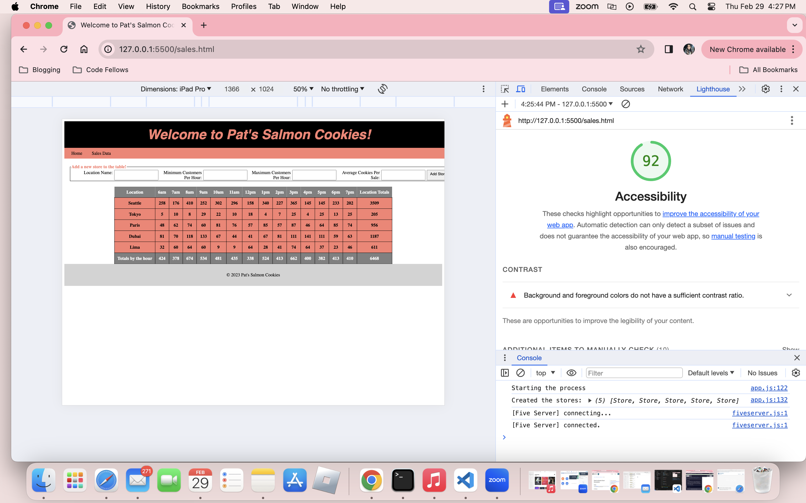

# cookie-stand

I've built a JavaScript program to simulate sales data for various cookie stores. It creates a Store constructor function to model each store's location, customer range, and average cookies sold per hour. The program then generates sales data based on these parameters.

To display the data, I've set up rendering functions for the table header, footer, and individual store rows. These functions organize the sales data into an HTML table, showing hourly sales and totals.

Additionally, the program allows users to add new stores through a form submission, enhancing its flexibility and scalability.

Overall, it's a straightforward tool for simulating and visualizing cookie store sales data.

## Monday Lighthouse

## Tuesday Lighthouse

## Wednesday Lighthouse

## Thursday Lighthouse

